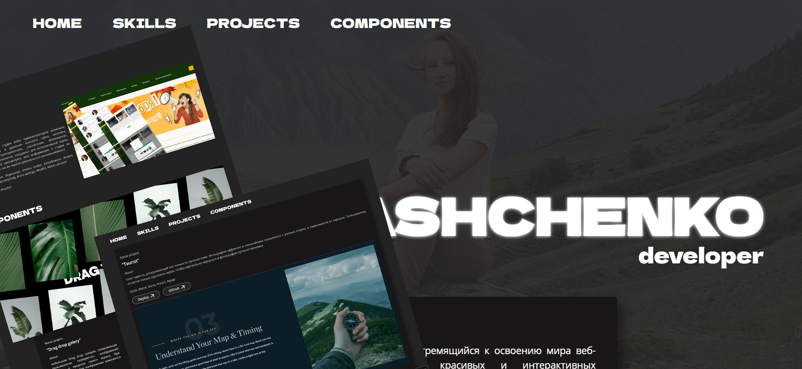

# Мое портфолио

## Содержание
- [Общая информация](#общая-информация)
- [Используемые технологии](#используемые-технологии)
- [Контакты](#контакты)

## Общая информация
Это мое персональное портфолио, разработанное с использованием React и Vite. В нем вы найдете информацию о моих проектах.

## Используемые технологии
- в качестве бэкэнда использовался Firebase Firestore;
- для управления состоянием данных и пользовательским интерфейсом в приложении использовался Redux;
- для настройки хранилища и выполнения наиболее распространенных операций с ним использовался Redux Toolkit;
- Prettier, Eslint – для форматирования и анализа написанного на JavaScript кода;
- для написания чистого и валидного CSS-кода - препроцессор Scss;
- для создания плавных анимаций элементов использовался Gsap.

## Контакты
Если у вас есть вопросы или предложения, вы можете связаться со мной:

- email: [iv_diana@bk.ru](mailto:iv_diana@bk.ru)
- telegram: [@endless_moonlight_on_monday](https://t.me/endless_moonlight_on_monday)
